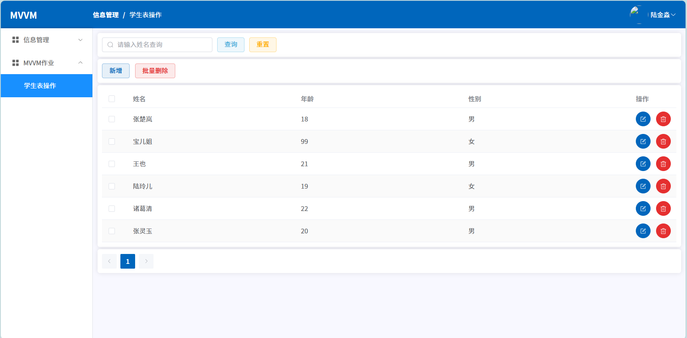
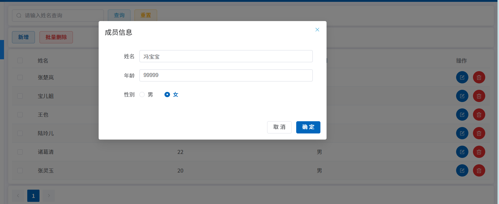
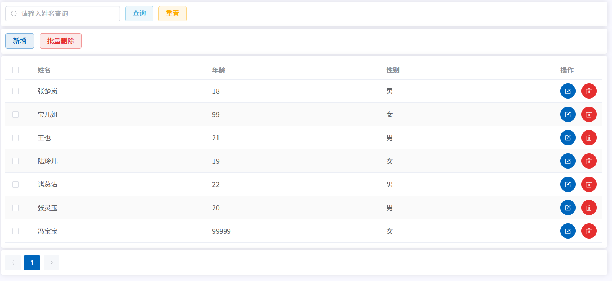
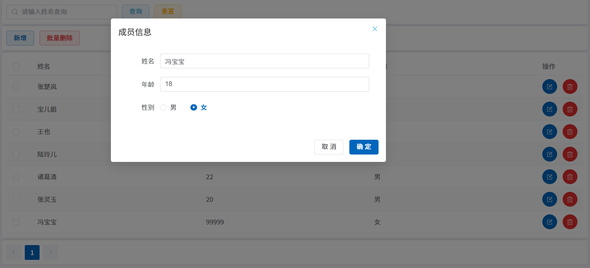
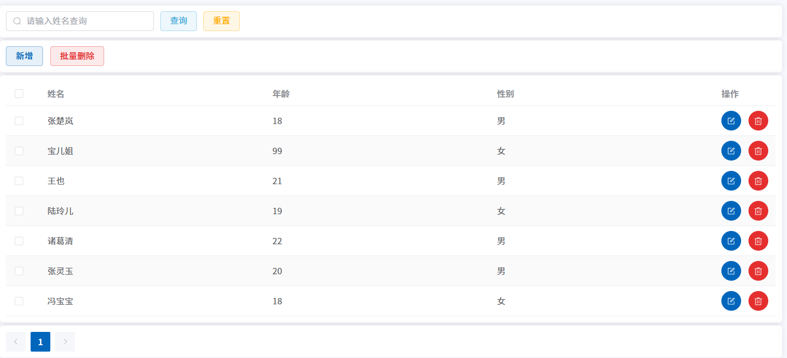
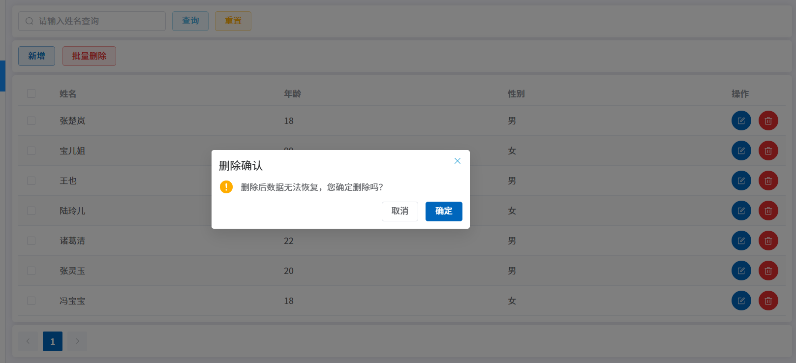
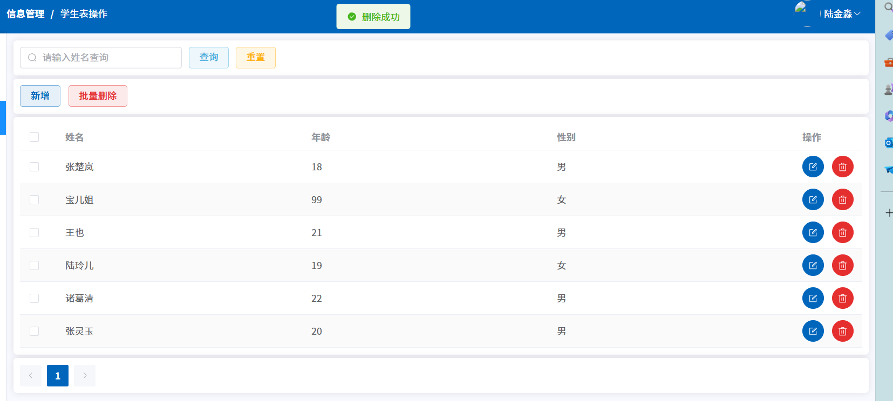

**学院：省级示范性软件学院**

**课程：高级数据库技术与应用**

**题目：** **《 作业四：学生表的CRUD操作》**

**姓名：** 陆金淼

**学号：** 2200770279

**班级：** 软工2203

**日期：** 2024-11-22

**要求：**

1. **使用前端模板完成CRUD的练习，要能够CRUD到后端的真实数据**
2. **对接后端的接口服务，可以是学生表，老师表，或员工表**
3. **提交代码和截图**

## 学生表的CRUD操作

### 1.学生表的原始数据：

```
-- ----------------------------
-- Table structure for student
-- ----------------------------
DROP TABLE IF EXISTS `student`;
CREATE TABLE `student`  (
  `id` int NOT NULL AUTO_INCREMENT,
  `name` varchar(20) CHARACTER SET utf8mb4 COLLATE utf8mb4_0900_ai_ci NOT NULL,
  `age` int NULL DEFAULT NULL,
  `gender` char(1) CHARACTER SET utf8mb4 COLLATE utf8mb4_0900_ai_ci NOT NULL,
  PRIMARY KEY (`id`) USING BTREE
) ENGINE = InnoDB AUTO_INCREMENT = 7 CHARACTER SET = utf8mb4 COLLATE = utf8mb4_0900_ai_ci ROW_FORMAT = Dynamic;

-- ----------------------------
-- Records of student
-- ----------------------------
INSERT INTO `student` VALUES (1, '张楚岚', 18, '男');
INSERT INTO `student` VALUES (2, '宝儿姐', 99, '女');
INSERT INTO `student` VALUES (3, '王也', 21, '男');
INSERT INTO `student` VALUES (4, '陆玲儿', 19, '女');
INSERT INTO `student` VALUES (5, '诸葛清', 22, '男');
INSERT INTO `student` VALUES (6, '张灵玉', 20, '男');

SET FOREIGN_KEY_CHECKS = 1;
```

没有任何进行操作的界面



### 2.新增

增加一条冯宝宝的信息



插入成功：



### 3.查询

查询冯宝宝的信息


查询成功

### 4.修改

修改冯宝宝的年龄为18



修改成功：



### 5.删除

删除冯宝宝的信息



删除成功：



相关代码见work4-Student_CRUD的其他文件。
